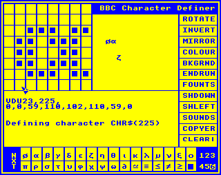

# A BBC Micro in the 21st Century

Once upon a time, in a very different century, I was working in my first job, as a software developer in a tiny company in a provincial city in the UK. In those days people, and indeed businesses, generally didn't have computers. The company I was working for was a cash-register dealer that had seen an opportunity in this new-fangled personal computer technology and was selling the [Commodore Pet](https://en.wikipedia.org/wiki/Commodore_PET) to local businesses. They had heard a rumour that I knew something about computers, tracked me down, and hired me to help them out by creating software for their clients, there being nothing available off the shelf. At this point there was no literature on how to do this, no internet, and nobody else in that city (or county, come to that) doing any of this so we had to make everything up from scratch, using little more than the [handbooks](http://www.zimmers.net/anonftp/pub/cbm/manuals/pet/BASIC_v4_Users_Reference_Manual.pdf) for the computers, which told us how the built-in BASIC interpreter worked, and an [indispensable book by Raeto West](https://archive.org/details/Programming_The_PET_CBM_197x_West_Raeto/mode/2up). This was what they call a "learning experience" and I loved it.

I, on my meagre salary, could not afford to own a Commodore Pet myself but I could, eventually, and with enough credit card abuse, afford a [BBC Micro](https://en.wikipedia.org/wiki/BBC_Micro). This was much more fun than a Commodore Pet anyway, having better hardware, a better BASIC, a better OS, and fancy things like colour graphics and sound. So when I was not writing Commodore Pet software at work I was writing BBC Micro software at home and I loved that even more. I did quite a bit of it, playing with all sorts of new ideas, and indeed eventually moved on to doing it for a living.

The foregoing will, I hope, serve as useful context for the story that follows. Recently I was searching my loft for something and stumbled on a trove of [cassette tapes](https://en.wikipedia.org/wiki/Compact_Cassette) containing some BBC Micro software from those early days, audio tape having been the normal way to store software when, like me, you could not afford something as sophisticated as a [5.25" disk drive](https://en.wikipedia.org/wiki/Floppy_disk). I was immediately overcome with nostalgia and wondered what long-forgotten gems might be on these tapes, how they might compare to the software I write today, and whether there was any way to recover them. I no longer possess a working BBC Micro, a cassette deck, a suitable monitor (or [PAL](https://en.wikipedia.org/wiki/PAL) TV!) that would serve as a display, nor anything else relevant. Thus a challenge presented itself: what could I do with these cassettes without spending a fortune on obsolete collector's pieces on eBay?

The first step was to convert the cassettes into something more manageable. This turned out to be fairly easy - my kids still had a cassette player, bought for them when they were much younger and wanted to be able to listen to the story tapes we kept in the car. A 3.5mm stereo jack-to-jack lead made for an easy connection from the headphone output to the mic input on my computer and a few minutes' experimentation with [Audacity](https://www.audacityteam.org/) yielded a configuration that allowed me to reliably capture the contents of a cassette as a WAV file. At the very least this would be secure from any further degradation of the tape - an archivable file that could potentially be replayed into the cassette port of an actual BBC Micro, if nothing else. But it doesn't seem beyond the potential capabilities of modern DSP software to be able to decode this file into the byte stream it represents, does it?

The next step - of *course* there's a way to do that! A little bit of googling and I discovered [Unified Emulator Format](https://en.wikipedia.org/wiki/Unified_Emulator_Format), a de-facto standard file format used to store representations of all the various media types used by Acorn computers, including BBC Micro cassettes. It didn't take much longer to discover that these files can be created from audio samples of actual cassettes using a freely available utility called [MakeUEF](https://www.stairwaytohell.com/essentials/index.html?page=homepage). A quick download (there's well under a megabyte of software, as we might expect for a utility with this heritage), a little bit of fiddling and I had a `.uef` file, 7KB (compressed) of precious data recovered from a cassette labelled "*chardef (c) Merlyn Kline 1984*". So now, what could I do with this? The clue is in the name of the file format of course - presumably there must be a BBC Micro Emulator that can make use of this.

Back to Google and here it is: [BeebEm](http://www.mkw.me.uk/beebem/), an  emulator for Windows that seems to cover all the bases - every variation of the BBC Micro, and a whole range of peripherals and add-ons, can be emulated with or without tweaks to take advantage of the fact that the hardware platform is so far advanced from the original (e.g. loading cassettes faster than real time). Another very quick download, start it up, load the file off the cassette, work out that this actually needs a [BBC Master](https://en.wikipedia.org/wiki/BBC_Master) variation of the BBC Micro (with 128KB of RAM!), and we're off - the program runs, and does everything it ever did, exactly as I (now) remember it. I'm not sure why it seems to need the BBC Master emulator as I now clearly remember writing it on a BBC Model B, but that seems a minor wrinkle. So what does it do and what is the code like?

Before looking at the program, a bit more background:

* First, in 1984 I had never seen a computer mouse. I had heard that such things existed, and that there was an idea that they might be a better way to interact with a computer than just a keyboard, and that this would work by moving the mouse to move a pointer on the screen and then using a button to "click" on parts of the screen. I was interested in this idea and wanted to experiment but the BBC Micro, of course, had no mouse and no support for such a thing. It did, however, have an [analogue joystick](http://www.computinghistory.org.uk/det/33654/Acorn-ANH01-BBC-Micro-Joysticks/) for playing games and I realised I could use this to create an experimental UI that was at least conceptually similar to a mouse.
* Second, the BBC Micro drew text on the screen using a font of 8x8 pixel characters - fixed spacing, two colours only, so each character was defined by 8 bytes. We sometimes created new characters, or even fonts, but this was a tedious, error-prone process of drawing the characters on graph paper and working out the bit patterns to create the 8 bytes of data needed for each character. I kid ye not. We did this because a carefully designed specialised character set provided a fast way of rendering graphics on the screen; faster than the OS drawing routines, if used with care.

The program on the tape then, it turned out, was my experiment to see what using a mouse might be like. An attempt to improve the process of defining new characters by offering a graphical UI allowing you to edit the definitions of the 32 characters with codes 224 to 256, a chunk of the ASCII space unused by the BBC Micro OS.

On running the program, I saw this (after I'd clicked around a bit):



I should note here that BeebEm, with its "Analogue Mousestick" option for analogue joystick emulation turned on, worked so well that when I moved the mouse over the emulator's window, the pointer drawn by my program tracked the Windows mouse pointer with complete precision so I was immediately able to click on things on the emulator Window and it all just worked. This was so intuitive that it was a short while before I realised it was happening and it occurred to me just how extraordinary it was! This software is 35 years old, running in an emulation of the hardware on a platform so advanced it would have been beyond my wildest dreams when I wrote the original, with a now quotidian input device that was almost mythical at the time, and everything was working exactly as intended!

Anyway, some features of this screenshot:

* That is the whole screen. It's probably tiny when you look at it on your screen but on a BBC Micro this was everything and it occupied the entire monitor, which was probably a 14 inch [CRT](https://en.wikipedia.org/wiki/Cathode-ray_tube) and had the 5:4 ratio you see here. The resolution of this screen mode was 320 x 256 pixels, yielding 32 rows of 40 characters.
* The system had no mouse pointer, nor any idea of a mouse, so I had to draw my own pointer. You can see it here, half way down on the left hand side. As you can probably tell, it was drawn on by an XOR process so it could be quickly removed and redrawn in a new location without the need to maintain a buffer with a copy of whatever was under it on the screen. That would have been too slow and would have used too much memory.
* In the top left part of the screen is an 8 by 8 grid showing the character currently being edited, here α. These pixels could be clicked to invert them.
* To the right of this is a scratchpad. You could click in here to drop a copy of the currently edited character and you could thus build up strings to see what they looked like in context. There are six of these scratchpads (for some reason!), selected using controls in the bottom left and right corners of the screen.
* Below this is a space that was used for various purposes. Here it shows the command you would need to put into a BBC BASIC program to create the edited character in its current state, i.e. `VDU23,225,` followed by the 8 bytes representing the current shape of the character. This updated as the character changed. On exit, this program would replace itself in memory with a BASIC program consisting of all the commands needed to generate the complete set of characters and you could then merge whichever bits you needed into whatever program you were writing that needed the newly defined characters.
* At the bottom of the screen is a grid of characters from which you could select the character to be defined. Here we see the special characters beyond the basic set that were used for most purposes. These were the most commonly redefined because you could add new characters without interfering normal text printing. There is also a picker for the six scratchpads to the right of this, and a button to the left labelled NXT which cycles through the active scratchpads.
* To the right of the screen is a menu of commands that could be selected by clicking on them:
  * ROTATE - Rotate the character right 90 degrees.
  * INVERT - Flip every pixel in the character.
  * MIRROR - Mirror the character.
  * COLOUR - Change the foreground colour of the screen. Just cycled through the seven available colours (skipping the eighth, which would be whatever the current background was and thus pointless).
  * BKGRND - Change the background colour of the screen, again by cycling and skipping the foreground.
  * ENDRUN - Exit the program and create a new one with the character defining commands in it.
  * FOUNTS - This was an accepted if somewhat unusual spelling of "fonts" at the time, used here to make the menu a consistent width I think! (Fonts were another new concept to me.) It displays a set of italic, bold and shadow options, with left- and right-biased versions of each, which were generated algorithmically. Selecting one applies it to the current character definition.
  * SHDOWN - Shift the current character definition down one row of pixels, moving the bottom row to the top so it all wraps round.
  * SHLEFT - Shift the character left one pixel, again wrapping round.
  * SOUNDS - Turn the (very annoying!) sound effects on or off.
  * COPYER - Present a display of the entire character set so one character could be clicked on to copy it to the currently edited character.
  * CLEAR! - Clear the current character definition or scratchpad (depending on a second click) completely.

Modesty being the last refuge of fools and incompetents, I will say that this program achieves its purpose very well: it makes defining characters quick and easy, multiple orders of magnitude easier than the process it replaced, and it provides a good selection of tools given the extremely limited computing resources. It also demonstrates what is now common knowledge, that a mouse based UI can be very effective for this purpose; doubly so now that I am able to repeat the experiment with an actual mouse, rather than an analogue joystick as a second-rate substitute (and do that without changing a single line of the code!). This was a revelation at the time. There were certainly other interactive programs around but they would have involved moving some sort of focus indicator around with the cursor keys and pressing command keys, or typing text, to make the software work. Performing this task in that way would have been tedious in the extreme. (In fact this program does support moving the pointer with the arrow keys and clicking with the spacebar, and doing this is indeed  tedious!) In addition to all this, I will also say that I think the design of the code is pretty good, again given the limitations of the system. I can quickly and easily understand how the program works despite it being well over 30 years since I last saw it or anything like it. I confess that the same cannot always be said of code I wrote last week! Much the same applies to the UI - it seems reasonably intuitive and is not unfamiliar to the user of a modern mouse & pointer based UI. Despite a few places in the code which give the appearance of not being quite complete (perhaps this is not the latest version of the code), the program is functionally complete and seems polished enough to have been suitable for commercial release, with a considerable level detail in the features that and implementation goes well beyond the needs of a simple mouse experiment or a personal utility. Despite that, I have no recollection of ever having sold it.

With that closing self-aggrandisement, I've finished telling the story I set out to tell and I've written a lot more than I intended to write in doing so. Now would be a good time for readers and writers alike to close the window and move on. However I myself am not going to do that quite yet so, if you're interested enough, do read on for a quick look at the code itself.

Merlyn Kline  
March 2020

## The code

I've appended the actual code at the end of this article for reference and if you really want to you can spin up a BBC Master 128K emulator and paste this code into the terminal - type RUN and you will see the program running. I'll take a quick look at some of the features of the code without trying to go into too much detail. If you really want to know more about any aspect of it you can find a [BBC Micro manual](http://bbc.nvg.org/doc/BBCUserGuide-1.00.pdf) on line. This manual, by the way, was pretty much the sum total of the information available when this program was written and it was only available as a printed book which came with the system, the character count alone being about 20 times the size of the RAM in a BBC Micro!

Before diving into the code I'll offer a little more background: The program is written in BBC BASIC, which was very advanced for its time and has unusual features such as being able to define named functions and procedures, and having a built-in 6502 assembler which allowed it to interact directly with machine code - a feature that is exploited here. The memory available was extremely limited and the code was stored and interpreted as written (although language keywords were stored in single bytes) so there is little in the way of decorative whitespace, and identifiers are very short, which can make the code hard to read when you're not familiar with the language. This is made worse by the fact that everything is uppercase. There is a simple type system, indicated by suffixes on the variable names (`%` for integers, `$` for strings, everything else being floating point). Operating system commands could be included in the code by prefixing them with a `*` or using the `OSCLI` command.

There were no dev tools as we know them today. The screen was tiny, with even the biggest mode having only 32 rows of 80 characters, and there wasn't really an editor. You could list chunks of the code using the `LIST` command, and you could "edit" a line by a process of copying it character by character, skipping unwanted ones and inserting new ones as you went. This was at least as tedious as it sounds! There was no way to search the code, or indeed do anything else at all really. Saving progress would have been many minutes of writing to a cassette tape so no source control and no reasonable way to revert to earlier versions. All of this certainly didn't encourage refactoring and even a simple task like changing the name of a variable would be near impossible if there were more than two or three references to it.

Looking at the code itself I do think, as mentioned before, that it is not too bad, all things considered. There are some oddities, like commented-out lines and lines with `GOTO`s jumping over them, which suggest that this is not a final version of the program. The names of some things reflect the difficulty of refactoring; it's evident that some parts of the code have evolved away from their original functions. The names and formatting also reflect the extreme memory restrictions. There are no comments in this code and while I would normally consider that to be a [good thing](CoodCodeHasNoComments) in the modern world, this is an example of a language where expression is limited enough that some comments might potentially be useful; on the other hand, memory is so restricted that they would be an impossible luxury. Despite all this the code seems reasonably well structured for the most part. Certainly I would feel comfortable enough maintaining it.

The system, of course, had no support for any kind of mouse input, and handling events at the high level of BASIC was unheard of, so for main the structure of the program I came up with the idea of a polling loop. This goes round and round, checking the joystick position and button states to decide what to do. Most functions that can be triggered execute quite quickly so they are completed immediately and control is returned to the main polling loop. Some functions present further UI to be interacted with and these draw the UI (e.g. the font picker) and then call the polling loop locally, remove their UI and return control to the main loop. The procedure `PROC CURS` implements the core polling loop and simply draws the pointer on the screen, then re-draws it to remove it (as it's an XOR process), checks for a button press, and exits if it detects one or loops until it does. It sets the global variables X% and Y% to the position of the pointer and other code decides what to do on the basis of the values in these.

The program starts with some basic initialisation, mostly in `PROC INIT`, to draw the screen and set up the sound. It also assembles some machine code (in `PROC A`) for processor-intensive activities, of which more later. It then calls the main polling loop on line 70 and takes action depending on the pointer position, on the following lines:

* 80: a click in the right-hand menu is detected and `PROC FUNCTION` is called to handle that, then control is returned to line 70.
* 90: a click in the scratch pad is detected and handled.
* 100: A click on the character picker at the bottom of the screen is detected and `PROC NEWCHAR` is called to handle it.
* 110: A click on one of the pixels in the large 8 x 8 grid is detected and handled via `PROC CHBIT`
* 120: A click on the program name is detected and handled by calling `PROC NAME`
* 130: If we get to here then the click was in a place that has no function so a sound is made (if sound is turned on, as indicated by a flag in the variable `S%`) and we go back to line 70 to await the next click.

That is the main program flow complete. The remaining code consists of subroutines, as 25 named functions and procedures, which implement the various functions. A quick look at these reveals some interesting features (and a great deal of banality!):

*`PROC SCREEN`* - Draws the whole screen. This exploits various special control characters, sent to the screen using `VDU` commands, as well as some simple graphics drawing.

*`PROC INIT`* - Initialises the system and storage etc. Some odd features here, e.g. on line 490 the 200 byte space for the scratch pad (reserved on line 270 at an address stored in `TB%`) is initialised to space characters by looping through writing a byte 32 to each byte address (this is an 8-bit system, remember!), and this is followed by a similar initialisation of the 1200 byte space at `STR%` (used for the six scratchpads) but this time we do it much faster by writing the 4 byte word 0x202020 at every 4th byte address. Not only does there seem to be no reason why the first space shouldn't be initialised using the faster algorithm, there also appears to be a classic off-by-one error which would result in a spurious extra byte being written after the end of the `TB%` space (the loop runs from 0 to 200)! Fortunately I think that the way the space is reserved, this just gets written into the first byte of `STR%`, which is initialised the same way anyway. How embarrassing! I guess we can at least say that this supports the oft-made observation that the two hard problems in computing are naming things, cache invalidation and off-by-one errors. Of note in here is the `?` operator, which reads or writes a byte at a specified address and offset, and the corresponding `!` operator which does the same for a four byte word; these are more useful equivalents of the `PEEK` and `POKE` functions found in Microsoft BASIC, and were complemented by a `$` operator which would read or write a string at a specified address.

*`PROC READ(C%)`* - Reads the current definition of the character with the ASCII code given in `C%`. This makes a call to an OS routine at the address 0xFFF1. Again, this is an 8-bit system with a 16 bit address bus - this address is right at the top of memory, where the OS kept a dispatch table. I don't know why I didn't have this address in a named variable (e.g. `OSWORD`) as I did `OSWRCH`! Note that the variables `A%`, `X%` and `Y%` are loaded into the 6502 processor's `A`, `X` and `Y` registers before the call is made, in this case giving an address for a parameter block and a function code telling the OS what we want it to do, here function 10 which reads a character definition. After reading, the definition is copied to our workspace at the address in `V%` and then we call `PROC VCS` to update the display of the character definition command.

*`PROC SET`* - Updates the definition of the currently edited character by issuing the `VDU 23` command as displayed. For some reason there are no blank lines separating this from the next PROC, unlike most other cases.

*`PROC VCS`* - Updates the display of the `VDU` command that would define the current character to reflect the current state of the editor.

*`PROC WRITE(N%)`* - Updates the display of which character we are currently defining.

*`PROC FILL`* - Updates the grid in the top left which shows the current character definition. Just a veneer for the machine code defined later.

*`FN CLR`* - Handler for a confirmation click after a click on the CLEAR! button. Highlights the button and then waits for another click and resets the button, returning a value indicating whether the confirmation click was in the character grid, the scratchpad or elsewhere. Note that BBC BASIC boolean expressions represent true and false as -1 and 0. This turned out to be quite useful for doing bitwise operations with the results in all sorts of horrible hacks needed to achieve useful performance!

*`PROC COPYER`* - Handler for a confirmation click after a click on the COPYER button. Highlights the button, draws the full character set, and then waits for another click and resets the button. If the confirmation click was on the character set, works out which character and reads the definition. Finally updates all the various parts of the display that need it.

*`PROC TYPEFACE`* - Handler for a confirmation click after a click on the FOUNTS button. Highlights the button, draws the font menu, and then waits for another click and resets the button. If the confirmation click was on the font menu, applies the chosen effect. Finally updates all the various parts of the display that need it.

*`PROC SPRN(A$,AD%)`* - Print a string with one of the font effects applied. This calls machine code at `SPR` for each character in the string, having first updated the code by writing the address of the appropriate code to apply the selected effect at the address `SPRVEC`. It's interesting that there are named constants for selecting the different effects even though they are not really used much. At the time this was written I think that being able to display things in different fonts was an innovation - any software that might have had occasional such effects on fixed screen titles or similar would have used hand-edited characters or graphics. I have a vague recollection of building a library that made this feature more widely available as an OS extension and this is probably a part of it; a precursor or an extract. I must dig further through my hoard of cassettes and see if I can find more evidence of that.

*`PROC ADLINE(A$)`* - Add a line to a BASIC program in memory. We can see here that programs are represented as two bytes containing the line number followed a single byte containing the length of the line, and then the contents of the line itself. This routine is used on exit, when building the program which will create the newly defined character set on demand.

*`PROC MPRG`* - Handler for the ENDRUN button. Constructs a new BASIC program in memory, in a separate area from the running program (i.e. just above `HIMEM`), which is a simple program to redefine a set of characters as created by this editor. We can see that the code 0xF4 is the code used for the keyword `REM` and 0xEF for the keyword `VDU`. This process is quite slow and can be interrupted by another click if it is started accidentally. Once complete, the F9 key is programmed to switch to the memory space in which the newly program has been created, and the F0 key is programmed to switch back to the memory space the editor is in and run it. Finally, an F9 keypress is inserted into the keyboard input buffer and the program quits. This trick allows the editor to effectively vanish and be replaced by the newly created program, allowing the user to save it for use as required and easily get back to the editor by pressing F0. This was the best mechanism I could come up with for making the created code easily available in wold where simply saving it to a file was not a sensible option.

*`PROC TABLE(C%)`*- Updates the screen with the passed-in character, first updating the right cell in the table at the bottom of the screen, then the redrawing the whole scratchpad by calling the machine code defined at the label `.TABLE` in `PROC A`. The name and structure of this suggest that the scratchpad was added to the design late in the day. This is called whenever the a character definition changes.

*`PROC DR`* - Draws the pointer on the screen, including the currently defined character if the pointer is over the scratchpad. Note that this uses `GCOL 3` mode, meaning that the plot uses exclusive-or to apply the pointer colour to the screen. This is a 1-bit-per-pixel screen mode, so each pixel under the pointer is flipped. Using this technique means that the pointer can be removed by simply drawing it again in the same place so there is no need to maintain a copy of what is under the pointer pointer for this purpose. Also of note is the check on line 1830 for a Ctrl-@ keypress, which causes a call to a non-standard OS command that dumps the screen to a specific printer that I had at the time (an [Epson FX-80](https://files.support.epson.com/pdf/fx80__/fx80__uv.pdf)).

*`PROC CURS`* - The main event loop. Draws the pointer, following the joystick position, and waits for a button click. Also handles detecting a space bar keypress and switching to keyboard mode if this happens, in which arrow key presses move the cursor and the space bar may be used as a button click. The `INKEY` function checks whether a specific key is down, e.g. `INKEY -99` tests the space bar.

*`FN CTRL`* - Checks for and handles switching between joystick and keyboard modes.

*`PROC NAME`* - Handler a click on the name of the program, switching between that and a copyright message.

*`PROC CALLCODE(ADDRESS%)`* - Calls machine code at a given address and then updates the current character definition and the parts of the screen where this is shown.

*`PROC FUNCTION(F%)`* - Handler for a click on one of the buttons. Line 2420 uses the BBC BASIC `ON GOTO` command to go to a different line depending on which button was pressed. Simple functions such as rotating the screen colours or turning sound on and of are handled immediately while more complex ones are delegated to their own procedures.

*`PROC NEWCHAR`* - Handler for a click on the character selector at the bottom. It looks as though the multiple scratchpad feature was a late addition because that's handled by a couple of inserted `GOTO`s at the beginning, one of which jumps over the next two `PROC` definitions!

*`PROC SVT(A%)`* - Saves a scratchpad, mostly by calling the machine code at `SVT`.

*`PROC RDT(A%)`* - Reads a scratchpad, mostly by calling the machine code at `RDT`, and updates the display.

*`PROC CHBIT(BY%,BT%)`* - Flips a bit in a byte in the current character definition and updates the display.

*`PROC A`* - Assembles the machine code used in various other places, using BBC BASIC's built in 6502 assembler. Note that this is done twice, in a loop, so that forward references can be resolved. To do this, the `OPT` pseudo-instruction is set to `0` which suppresses errors so that on the first pass the forward-references to missing labels won't be complained about and on the second pass they will work because the labels were defined in the first. During debugging you would use `OPT I%` to enable error reporting, assembly listing and bounds checking on the second pass. The labels on the entry points are:

* `ROTATE` - Rotates current character definition by 90 degrees into a buffer at `BLK%` before copying back to the current definition at `V%`. Note how this allows for easy communication between the BASIC and assembler code. The algorithm takes each byte (i,e, row of 8 pixels) of the character definition and the performs 8 rotations of that byte, rotating the top bit into the bottom bit of each of the 8 bytes of the target. After repeating this 8 times the target contains the rotated character.
* `INVERT` - Flips every bit in the current character definition by simply XORing each byte with 255.
* `FILL` - Fills the character definition grid with the current character definition by writing space characters with the background and foreground colours set according to the status of each bit.
* `MIRROR` - Mirrors the current character definition around a vertical axis, using the buffer at `BLK%`, by rotating the bytes left so that each bit is rotated into the carry bit and then rotated right into the buffer.
* `SHDOWN` - Shifts the current character definition down one pixel, moving the bottom row of pixels to the top. This is done in place, using the `Y` register to store the bottom row while the rest are shifted.
* `SHLEFT` - Shifts the current character definition left one pixel, moving the left column of pixels to the right. Each byte is shifted left one bit and then 0 is added so that what was previously the top bit, now in the carry bit, becomes the bottom bit.
* `TABLE` - Writes the current scratchpad on the screen.
* `BLANK` - Blanks the current character definition. I'm not convinced there was much speed gain by doing this in machine code!
* `ITALIC` - Applies an algorithmic italic effect to the current character definition. This uses the `SHLEFT` code, above, to shift the definition left until there is a bit set in the left hand column, then shifts the rows by different amounts to the right - more at the top than the bottom.
* `BOLD` - Applies an algorithmic bold effect to the current character definition. Takes each byte, shifts it one bit to the right, then ors it with the original.
* `SHADOW` - Applies an algorithmic shadow effect to the current character definition by setting pixels below and to the right, and removing the originals by means of an xor.
* `LITAL` - Applies  an algorithmic italic effect but this time leaning to the left.
* `LBOLD` - Applies an algorithmic bold effect but this time setting extra pixels to the left.
* `LSHADOW` - Applies an algorithmic shadow effect but this time with the shadow below and to the left.
* `SPR` - Prints a string with one of the above effects applied. This works by loading the definition of each character in the string, applying the effect, using the result to redefine character 255 and then writing that to the screen. Note that the subroutine call (`JSR`) at `SPRVEC` is to 0x0000 - this is overwritten with the address of one of the font-effect subroutines by the calling code before `SPR` is called. Also note that the last thing this routine does is jump (`JMP`) into the OS write character routine at 0xFFEE, rather than calling it as a subroutine - a tail-call optimisation! I don't know why this code doesn't use the label `OSWRCH` to call write character routine, given that we've gone to the effort to create that on line 480.
* `SVT` - Saves the current scratchpad to one of the six scratchpad spaces.

So, finally, here is the code pretty much as I found it on the cassette. I've removed some comments at the top and bottom which contained control characters that were there to make it difficult to get a listing of the code. Otherwise, this is it:

```BBC BASIC
   30*FX200,0
   40*FX4,1
   50REM ON ERROR RUN
   60MODE4:HIMEM=&5000:PROCINIT
   70SOUND&11,0,0,1:SOUND&10,0,0,1:PROCCURS
   80IFX%>1040ANDY%>175ANDY%<931THENPROCFUNCTION((Y%-175)DIV63+1):GOTO70
   90IFX%>544ANDX%<1024ANDY%>524ANDY%<940THENSOUND1,10*S%,175,1:XT%=X%:YT%=Y%:X%=(X%-544)DIV32:Y%=(416-(Y%-512))DIV32:X%=TB%+Y%*15+X%:?X%=CHAR%+(CHAR%-32)*(?X%=CHAR%):X%=XT%:Y%=YT%:CALLTABLE:GOTO70
  100IFY%>0ANDY%<160THENPROCNEWCHAR:GOTO70
  110IFX%<528ANDY%>495ANDX%>20THENPROCCHBIT(((1007-Y%)DIV64)+1,7-(X%-20)DIV66):GOTO70
  120IFX%>500ANDY%>940THENPROCNAME:GOTO70
  130IFS%SOUND0,-10,4,1:TIME=0:REPEATUNTILTIME
  140GOTO70
  150END
  160
  170
  180
  190DEFPROCSCREEN
  200
  210CLS
  220GOTO240
  230VDU25,64,16;0;25,5,16;1007;25,5,1279;1007;25,5,1279;0;25,5,20;0;25,5,20;1007;25,64,1275;0;25,5,1275;1007;
  240FORI%=0TO8:MOVEI%*64+20,1007:DRAWI%*64+20,495:MOVEI%*64+16,1007:DRAWI%*64+16,495:MOVE16,1007-I%*64:DRAW528,1007-I%*64
  250NEXT:RESTORE320:FORI%=1TO12:READA$:PRINTTAB(33,I%*2+1)A$;:MOVE1039,1007-I%*64:DRAW1279,1007-I%*64:NEXT:MOVE1039,1007:DRAW1039,165:MOVE1035,1007:DRAW1035,165
  260MOVE16,495:DRAW1279,495
  270COLOUR129:COLOUR0:PRINTTAB(17,1)" BBC Character Definer "
  280MOVE528,1007:MOVE1279,1007:PLOT85,528,992:PLOT85,1279,992:MOVE528,992:MOVE528,956:PLOT85,576,992:PLOT85,576,956
  290MOVE528,960:MOVE1279,960:PLOT85,528,940:PLOT85,1279,940
  300MOVE16,160:DRAW1279,160:MOVE16,80:DRAW1279,80:FORI%=0TO16:MOVEI%*64+112,160:DRAWI%*64+112,0:MOVEI%*64+116,160:DRAWI%*64+116,0:NEXT
  310MOVE16,0:MOVE16,160:PLOT85,112,0:PLOT85,112,160:MOVE1140,0:MOVE1140,160:PLOT85,1279,0:PLOT85,1279,160
  320DATAROTATE,INVERT,MIRROR,COLOUR,BKGRND,ENDRUN,FOUNTS,SHDOWN,SHLEFT,SOUNDS,COPYER,CLEAR!
  321PRINTTAB(36,28)"123"TAB(36,30)"456"TAB(2,28)"N"TAB(2,29)"X"TAB(2,30)"T";:COLOUR128:COLOUR1:PRINTTAB(36,28)"1";:OTB%=1
  330GCOL0,1:FORI%=0TO20STEP4:MOVEI%,I%:DRAWI%,1023-I%:DRAW1279-I%,1023-I%:DRAW1279-I%,I%:DRAWI%,I%:NEXT
  340GCOL0,0:FORI%=8TO12STEP4:MOVEI%,I%:DRAWI%,1023-I%:DRAW1279-I%,1023-I%:DRAW1279-I%,I%:DRAWI%,I%:NEXT:GCOL0,1
  350FORI%=224TO255:PROCTABLE(I%):NEXT
  360ENDPROC
  370
  380
  390
  400DEFPROCINIT
  410
  420VDU23,1,0;0;0;0;:*KEY10O.|M
  430ENVELOPE1,2,17,17,17,10,10,10,20,20,20,20,100,200:ENVELOPE2,2,-17,-17,-17,10,10,10,20,20,20,20,100,200:ENVELOPE3,0,17,17,-17,1,0,1,20,20,20,20,100,200:ENVELOPE4,2,-7,-7,-7,10,10,10,0,0,0,0,1,1
  440ENVELOPE5,1,-26,-36,-45,255,255,255,127,0,0,-127,90,0:SOUND&11,5,255,255
  450ENVELOPE6,1,-13,11,-8,14,11,10,126,-1,0,-1,126,63
  460ENVELOPE7,1,-16,-26,-35,20,20,20,127,0,0,-127,90,0
  470DIMCODE% 700,V% 10,BLK% 10,SV% 10,TB% 200,STR% 1200
  480OSWRCH=&FFEE
  490FORI%=0TO200:TB%?I%=32:NEXT
  495FORI%=0TO1198STEP4:STR%!I%=&20202020:NEXT
  500PROCA
  510BKG%=3:FGR%=4:CHAR%=224:VDU19,1,FGR%;0;19,0,BKG%;0;
  520X%=656:Y%=528:LX%=X%:LY%=Y%
  530PROCSCREEN
  540PROCREAD(CHAR%)
  550PROCWRITE(CHAR%)
  560PROCTABLE(CHAR%)
  570PROCFILL
  580S%=TRUE
  590NAME%=TRUE
  600CCH%=0
  610JOY%=TRUE:STP%=32
  620*FX20,0
  630VDU19,1,FGR%;0;19,0,BKG%;0;
  640ENDPROC
  650
  660
  670
  680DEFPROCREAD(C%)
  690
  700LOCALX%,Y%,A%
  710X%=BLK%MOD256:Y%=BLK%DIV256:?BLK%=C%:A%=10:CALL&FFF1:FORI%=0TO8:V%?I%=BLK%?I%:NEXT:PROCVCS:ENDPROC
  720
  730
  740
  750DEFPROCSET
  760
  770VDU23:FORI%=0TO8:VDUV%?I%:NEXT:PROCVCS:ENDPROC
  780DEFPROCVCS
  790PRINTTAB(1,18)"VDU23,";V%?0",";SPC(32-POS);:PRINTTAB(1,19);:FORI%=1TO7:PRINT;V%?I%",";:NEXT:PRINT;V%?8;SPC(32-POS)
  800ENDPROC
  810
  820
  830
  840DEFPROCWRITE(N%)
  850
  860PRINTTAB(1,22)"Defining character CHR$(";CHAR%;")  ";
  870ENDPROC
  880
  890
  900
  910DEFPROCFILL
  920
  930CALLFILL:COLOUR1:COLOUR128:ENDPROC
  940ENDPROC
  950
  960
  970
  980DEFFNCLR
  990
 1000IFS%SOUND1,6,200,255
 1010COLOUR129:COLOUR0:PRINTTAB(33,25)"CLEAR!":COLOUR128:COLOUR1:PROCCURS:PRINTTAB(33,25)"CLEAR!"
 1020IFX%>544ANDX%<1024ANDY%>524ANDY%<940THEN=2
 1030=-(X%<528ANDY%>495ANDX%>20)
 1040
 1050
 1060
 1070DEFPROCCOPYER
 1080
 1090CT%=CHAR%:PRINTTAB(33,23);:COLOUR0:COLOUR129:PRINT"COPYER";:COLOUR1:COLOUR128:IFS%SOUND1,-10,200,3:SOUND1,0,0,1:SOUND1,-10,200,3:SOUND1,0,0,1:REPEATUNTILADVAL(-6)=15
 1100VDU28,1,25,31,17,12:FORI%=32TO255:VDUI%+95*(I%=127):NEXT
 1110PROCCURS:IFX%>1023ORX%<32ORY%>480ORY%<191GOTO1150
 1120IFS%SOUND0,-10,2,3
 1130CHAR%=(X%DIV32+(289-(Y%-191))DIV32*31)MOD225+31
 1140VDU28,1,17,1,17:PROCREAD(CHAR%):V%?0=CT%:CHAR%=CT%:PROCSET
 1150CCH%=0:VDU28,1,25,31,17,12,26,31,33,23:PRINT"COPYER";:IFS%SOUND1,-10,150,3:SOUND1,0,0,1:SOUND1,-10,150,3:SOUND1,0,0,1:REPEATUNTILADVAL(-6)=15
 1160CHAR%=CT%:PROCREAD(CHAR%):PROCWRITE(CHAR%):PROCFILL:PROCTABLE(CHAR%):ENDPROC
 1170
 1180
 1190
 1200DEFPROCTYPEFACE
 1210
 1220IFS%SOUND1,6,100,5:SOUND1,0,0,0
 1230PRINTTAB(33,15);:COLOUR0:COLOUR129:PRINT"FOUNTS";:COLOUR1:COLOUR128
 1240GCOL0,1:VDU28,1,25,31,17,12,29,0;0;26:FORI%=9TO12:MOVE100,1007-I%*64:DRAW750,1007-I%*64:NEXT:MOVE100,431:DRAW100,239:MOVE104,239:DRAW104,431:MOVE750,431:DRAW750,239:MOVE754,239:DRAW754,431
 1250MOVE425,239:DRAW425,431:MOVE429,239:DRAW429,431
 1260PRINTTAB(4,19);:PROCSPRN("Italic",LITAL):PRINTTAB(4,21);:PROCSPRN("Boldface",LBOLD):PRINTTAB(4,23);:PROCSPRN("Shadow",LSHADOW)
 1270PRINTTAB(17,19);:PROCSPRN("Italic",ITALIC):PRINTTAB(15,21);:PROCSPRN("Boldface",BOLD):PRINTTAB(17,23);:PROCSPRN("Shadow",SHADOW)
 1280REPEATUNTILADVAL-6=15:SOUND&11,0,0,0
 1290VDU26:PROCCURS:VDU28,1,25,31,17,12,26:IFX%<100ORX%>750ORY%<239ORY%>431SOUND1,10*S%,100,1:GOTO1330
 1300LH%=-(X%<427):RH%=-(X%>426):IFY%<304SOUND0,2,4,-10*S%:SOUND1,S%*10,150,10:PROCCALLCODE(SHADOW*RH%+LSHADOW*LH%)
 1310IFY%>303ANDY%<368SOUND0,2,4,-10*S%:SOUND1,S%*10,100,10:PROCCALLCODE(BOLD*RH%+LBOLD*LH%)
 1320IFY%>367SOUND0,2,4,-10*S%:SOUND1,S%*10,50,10:PROCCALLCODE(ITALIC*RH%+LITAL*LH%)
 1330PRINTTAB(33,15)"FOUNTS";:PROCREAD(CHAR%):PROCWRITE(CHAR%):ENDPROC
 1340
 1350
 1360
 1370DEFPROCSPRN(A$,AD%)
 1380
 1390LOCALX%,Y%,A%:X%=SV%MOD256:Y%=SV%DIV256:?SV%=255:A%=10:CALL&FFF1:?(SPRVEC+1)=AD%MOD256:?(SPRVEC+2)=AD%DIV256
 1400FORJ%=1TOLENA$:A%=ASCMID$(A$,J%):CALL SPR:NEXT
 1410VDU23,255:FORI%=1TO8:VDUSV%?I%:NEXT:?V%=CHAR%:X%=V%MOD256:Y%=V%DIV256:A%=10:CALL&FFF1:ENDPROC
 1420
 1430
 1440
 1450DEFPROCADLINE(A$)
 1460
 1470?ADD%=LINN%DIV256:ADD%?1=LINN%MOD256:ADD%?2=LENA$+4:$(ADD%+3)=A$:ADD%=ADD%+4+LENA$
 1480LINN%=LINN%+10
 1490ENDPROC
 1500
 1510
 1520
 1530DEFPROCMPRG
 1540
 1550PRINTTAB(33,13);:COLOUR0:COLOUR129:PRINT"ENDRUN";:COLOUR1:COLOUR128
 1560CT%=CHAR%:COLOUR129:COLOUR0:PRINTTAB(1,22)" Please wait, creating program "TAB(1,21)SPC31TAB(1,23)SPC31;:COLOUR1:COLOUR128
 1570LINN%=10:ADD%=HIMEM+1:?HIMEM=13
 1580PROCADLINE("basecode%=224:"+CHR$&F4+"  Start code for definitions")
 1590FORCHAR%=224TO255:PROCREAD(CHAR%):A$=CHR$&EF+"23,basecode%+"+STR$(CHAR%-224):FORJ%=1TO8:A$=A$+","+STR$(V%?J%):NEXT:PROCADLINE(A$)
 1600IFINKEY-99OR(ADVAL(0)AND3)>0THENCHAR%=300:NEXT:CHAR%=CT%:VDU28,1,25,31,17,12,26:PROCREAD(CHAR%):PROCWRITE(CHAR%):PROCFILL:PRINTTAB(33,13)"ENDRUN";:ENDPROC
 1610NEXT:PROCADLINE(" "):PROCADLINE(" ")
 1620PROCADLINE(CHR$&F4+"  You may save and load this program as usual and the variable basecode may be altered to change the range defined. Merge with other software to use (renumber if necessary).")
 1630PROCADLINE(CHR$&F4+"   By creating several of these programs and altering basecode, you may define the entire range of characters.")
 1640PROCADLINE(" "):PROCADLINE(CHR$&F4+" USE RED KEY F0 TO RESTART AFTER SAVING THIS PROGRAM")
 1650?ADD%=255:ADD%?1=255
 1660A$=STR$(PAGE):A$="|U|V7PA.="+A$+"|MO.|MRUN|M":OSCLI("KEY0"+A$)
 1670*KEY9|U|LPA.=&5000|MHIM.=&5800|MO.|M*FX200,0|ML.|L|M
 1680*FX15,0
 1690*FX138,0,137
 1700VDU20,23,1,1;0;0;0;
 1710END
 1720
 1730
 1740
 1750DEFPROCTABLE(C%):VDU26:COLOUR1:COLOUR128:PRINTTAB(((C%-224)MOD16)*2+4,((C%-224)DIV16)*2+28)CHR$C%;
 1760CALLTABLE
 1770ENDPROC
 1780
 1790
 1800
 1810DEFPROCDR
 1820
 1830IFINKEY(0)=0THENOSCLI"GWINDOW":OSCLI"GIMAGE EPSON T R1":VDU26
 1840GCOL3,1:VDU29,X%;Y%;:MOVE0,0:MOVE40,-20:PLOT85,20,-40:IFX%<545ORX%>1023ORY%>939ORY%<525ENDPROC
 1850MOVE-16,16:VDU5,CHAR%,4,26,10,8,23,1,0;0;0;0;:ENDPROC
 1860
 1870
 1880
 1890DEFPROCCURS
 1900
 1910IFFNCTRL GOTO1990
 1920PROCDR:REPEATOSCLI"FX19":PROCDR:X%=(65536-ADVAL(1))/53+22:Y%=ADVAL(2)/66+16
 1930IFINKEY-99THENUNTILTRUE:X%=656:Y%=528:GOTO1910
 1940PROCDR:UNTIL(ADVAL(0)AND3)=0
 1950REPEATOSCLI"FX19":PROCDR:X%=(65536-ADVAL(1))/53+22:Y%=ADVAL(2)/66+16
 1960IFINKEY-99THENUNTILTRUE:X%=656:Y%=528:GOTO1910
 1970PROCDR:UNTIL(ADVAL(0)AND3)
 1980PROCDR:ENDPROC
 1990PROCDR:REPEAT:OSCLI"FX19":PROCDR
 2000Y%=Y%+STP%*INKEY-42-STP%*INKEY-58:IFY%>1023THENY%=16:ELSEIFY%<0Y%=1007
 2010X%=X%+STP%*INKEY-26-STP%*INKEY-122:IFX%>1279THENX%=16:ELSEIFX%<0X%=1263
 2020IF(ADVAL(0)AND3)>0THENUNTILTRUE:GOTO1910
 2030PROCDR:UNTILNOTINKEY-99
 2040REPEAT:OSCLI"FX19":PROCDR
 2050Y%=Y%+STP%*INKEY-42-STP%*INKEY-58:IFY%>1023THENY%=16:ELSEIFY%<0Y%=1007
 2060X%=X%+STP%*INKEY-26-STP%*INKEY-122:IFX%>1279THENX%=16:ELSEIFX%<0X%=1263
 2070IF(ADVAL(0)AND3)>0THENUNTILTRUE:GOTO1910
 2080PROCDR:UNTILINKEY-99:PROCDR:ENDPROC
 2090
 2100
 2110
 2120DEFFNCTRL
 2130
 2140IFJOY%JOY%=NOTINKEY-99ELSEJOY%=(ADVAL(0)AND3)>0
 2150=NOTJOY%
 2160IFJOY%GOTO2190
 2170IF(ADVAL(0)AND3)>0JOY%=TRUE
 2180=NOTJOY%
 2190IF(INKEY-99)THENJOY%=FALSE
 2200=NOTJOY%
 2210
 2220
 2230
 2240DEFPROCNAME
 2250
 2260IFS%SOUND0,-15,7,3:SOUND1,5,200,3:SOUND1,0,0,1:REPEATUNTILADVAL(-6)=15
 2270NAME%=NOTNAME%:COLOUR129:COLOUR0:PRINTTAB(17,1);:IFNAME%THENPRINT" BBC Character Definer":ELSEPRINT" (c) Merlyn Kline 1984"
 2280COLOUR1:COLOUR128
 2290ENDPROC
 2300
 2310
 2320
 2330DEFPROCCALLCODE(ADDRESS%)
 2340
 2350CALL ADDRESS%:PROCSET:PROCTABLE(CHAR%):PROCFILL
 2360ENDPROC
 2370
 2380
 2390
 2400DEFPROCFUNCTION(F%)
 2410
 2420ON(13-F%)GOTO2430,2470,2500,2530,2550,2570,2590,2610,2670,2730,2760,2770
 2430REPEATIFS%SOUND&11,1,10,100
 2440PROCCALLCODE(ROTATE)
 2450UNTIL(ADVAL(0)AND3)=0ANDNOTINKEY-99
 2460ENDPROC
 2470IFS%SOUND1,2,200,3
 2480PROCCALLCODE(INVERT)
 2490ENDPROC
 2500IFS%SOUND0,3,100,3:SOUND1,3,140,3
 2510PROCCALLCODE(MIRROR)
 2520ENDPROC
 2530IFS%SOUND1,-10,250,100:TIME=0:REPEATUNTILTIME
 2540REPEATFGR%=(FGR%+1)MOD8:UNTILBKG%<>FGR%:VDU19,1,FGR%,0,0,0:ENDPROC
 2550IFS%SOUND1,-10,250,100:TIME=0:REPEATUNTILTIME
 2560REPEATBKG%=(BKG%+1)MOD8:UNTILBKG%<>FGR%:VDU19,0,BKG%,0,0,0:ENDPROC
 2570IFS%SOUND1,5,255,255
 2580PROCMPRG:ENDPROC
 2590PROCTYPEFACE
 2600ENDPROC
 2610REM SHDOWN
 2620REPEAT
 2630IFS%SOUND&11,4,200,30:SOUND&10,-15,7,30
 2640PROCCALLCODE(SHDOWN)
 2650UNTIL(ADVAL(0)AND3)=0ANDNOTINKEY-99
 2660ENDPROC
 2670REM SHLEFT
 2680REPEAT
 2690IFS%SOUND&10,0,0,1:SOUND0,-10,4,10
 2700PROCCALLCODE(SHLEFT)
 2710UNTIL(ADVAL(0)AND3)=0ANDNOTINKEY-99
 2720ENDPROC
 2730S%=NOTS%:IFS%FORI%=50TO250STEP25:SOUND1,-10,I%,1:NEXT:REPEATUNTILADVAL(-6)=15
 2740PRINTTAB(33,21);:IFS%PRINT"SOUNDS"ELSEPRINT"SILENT"
 2750ENDPROC
 2760PROCCOPYER:ENDPROC
 2770REM
 2780ONFNCLR GOTO2800,2820:ELSEIFS%SOUND&11,-10,100,2:SOUND1,0,0,1:REPEATUNTILADVAL(-6)=15
 2790ENDPROC
 2800IFS%SOUND0,-10,4,100
 2810PROCCALLCODE(BLANK):ENDPROC
 2820IFS%SOUND0,-10,5,100
 2830FORI%=0TO200:TB%?I%=32:NEXT:PROCTABLE(CHAR%)
 2840ENDPROC
 2850
 2860
 2870
 2880DEFPROCNEWCHAR
 2881REMX%>120ANDX%<1120
 2890
 2895IFX%>1119GOTO2911
 2896IFX%<121GOTO2914
 2900IFS%SOUND&11,7,1,255
 2910PROCSET:PROCTABLE(CHAR%):CHAR%=(X%-120)DIV63+224+16*((160-Y%)DIV80):PROCREAD(CHAR%):PROCFILL:PROCTABLE(CHAR%):PROCWRITE(CHAR%):ENDPROC
 2911NTB%=(X%-1119)DIV54-3*(Y%<80)+1:PROCSVT(OTB%):PROCRDT(NTB%):OTB%=NTB%:ENDPROC
 2912DEFPROCSVT(A%):COLOUR129:COLOUR0:PRINTTAB(36+((A%-1)MOD3),28-2*(A%>3));A%;:A%=(A%-1)*200+STR%:?(SVA+1)=A%MOD256:?(SVA+2)=A%DIV 256:CALLSVT:ENDPROC
 2913DEFPROCRDT(A%):COLOUR128:COLOUR1:PRINTTAB(36+((A%-1)MOD3),28-2*(A%>3));A%;:A%=(A%-1)*200+STR%:?(RDA+1)=A%MOD256:?(RDA+2)=A%DIV256:CALLRDT:CALLTABLE:ENDPROC
 2914REPEAT:PROCSVT(OTB%):REPEATOTB%=OTB%+1:IFOTB%>6 OTB%=1
 2915A%=(OTB%-1)*200+STR%:?(RDA+1)=A%MOD256:?(RDA+2)=A%DIV256:CALLRDT:UNTIL?TF1<>32OR OTB%=1:PROCRDT(OTB%):TIME=0:REPEATUNTILTIME>Y%DIV5
 2916UNTIL(ADVAL(0)AND3)=0ANDNOTINKEY-99:ENDPROC
 2920
 2930
 2940
 2950DEFPROCCHBIT(BY%,BT%)
 2960
 2970IFS%SOUND1,-10,200+100*((V%?BY%AND2^BT%)>0),1
 2980V%?BY%=V%?BY%EOR2^BT%:PROCSET:PROCTABLE(CHAR%):PROCFILL
 2990ENDPROC
 3000
 3010
 3020
 3030DEFPROCA
 3040
 3050FORI%=0TO3STEP3:P%=CODE%:[OPT0
 3060.ROTATE:LDX#7:LDA#0:.RCLR:STA BLK%+1,X:DEX:BPL RCLR:LDY#7:.RBYT:LDX#0:LDA V%+1,Y:.RBIT:ASL A:ROL BLK%+1,X:INX:CPX#8:BNE RBIT:DEY:BPL RBYT:LDX#7:.RMOV:LDA BLK%+1,X:STA V%+1,X:DEX:BPL RMOV:RTS
 3070.INVERT:LDX#7:.IBYT:LDA V%+1,X:EOR#255:STA V%+1,X:DEX:BPL IBYT:RTS
 3080.FILL:LDX#7:.FBYT:LDA#31:JSR OSWRCH:LDA#15:JSR OSWRCH:TXA:ASL A:CLC:ADC#1:JSR OSWRCH:LDY#7:LDA V%+1,X:.FBIT:LSR A:PHA:PHP:LDA#17:JSR OSWRCH:LDA#0:PLP:PHP:ROL A:ORA#128:JSR OSWRCH:LDA#17:JSR OSWRCH:LDA#0:PLP:ROLA:EOR#1:JSR OSWRCH
 3090LDA#32:JSR OSWRCH:LDA #8:JSR OSWRCH::JSR OSWRCH:JSR OSWRCH:PLA:DEY:BPL FBIT
 3100DEX:BPL FBYT:RTS
 3110.MIRROR:LDX#7:LDA#0:.MCLR:STA BLK%+1,X:DEX:BPL MCLR:LDX#7:.MBYT:LDY#7:LDA V%+1,X:.MBIT:ASL A:ROR BLK%+1,X:DEY:BPL MBIT:DEX:BPL MBYT:LDX#7:.MMOV:LDA BLK%+1,X:STA V%+1,X:DEX:BPL MMOV:RTS
 3120.SHDOWN:LDY V%+8:LDX#6:.SHLOOP:LDA V%+1,X:STA V%+2,X:DEX:BPL SHLOOP:STY V%+1:RTS
 3130.SHLEFT:LDX#7:.SHLEF1:LDA V%+1,X:ASL A:ADC #0:STA V%+1,X:DEX:BPL SHLEF1:RTS
 3140.TABLE:LDX#0:LDA#3:PHA:.TLINE:LDA#31:JSROSWRCH:LDA#17:JSROSWRCH:PLA:JSROSWRCH:CLC:ADC#1:PHA:LDY#15:.TCOL:LDA TB%,X:JSROSWRCH:INX:CPX#195:BEQTROUT:DEY:BNETCOL:BEQTLINE:.TROUT:PLA:RTS
 3150.BLANK:LDX#8:LDA#0:.B1:STAV%,X:DEX:BNEB1:RTS
 3160.ITALIC:LDA#8:STA BLK%+1:LDA#6:STA BLK%+2:.NXCHNK:LDX#7:LDA#0:.CHKLFT:ORA V%+1,X:DEX:BPL CHKLFT:AND#128:BNE DOCHNK:JSR SHLEFT:DEC BLK%+1:BNE NXCHNK:RTS
 3170.DOCHNK:LDX#0:.NXLIN:LDA V%+1,X:CLC:ROR A:STA V%+1,X:INX:CPX BLK%+2:BNE NXLIN:TXA:SEC:SBC#2:STA BLK%+2:BNE NXCHNK:RTS
 3180.BOLD:LDX#7:.BOLDL1:LDA V%+1,X:LSR A:ORA V%+1,X:STA V%+1,X:DEX:BPL BOLDL1:RTS
 3190.SHADOW:LDX#7:.SHDL1:LDA V%,X:LSR A:ORA V%,X:ORA V%+1,X:EOR V%+1,X:STA V%+1,X:DEX:BNE SHDL1:LDA V%+1:LSR A:ORA V%+1:EOR V%+1:STA V%+1:RTS
 3200.LITAL:LDA#8:STA BLK%+1:LDA#6:STA BLK%+2:.LINXCHNK:LDX#7:LDA#0:.CHKRHT:ORA V%+1,X:DEX:BPL CHKRHT:AND#1:BNE LDOCHNK:JSR SHRHT:DEC BLK%+1:BNE LINXCHNK:RTS
 3210.LDOCHNK:LDX#0:.LINXLIN:LDA V%+1,X:ASL A:STA V%+1,X:INX:CPX BLK%+2:BNE LINXLIN:TXA:SEC:SBC#2:STA BLK%+2:BNE LINXCHNK:RTS
 3220.SHRHT:LDX#7:.SHR1:LDA V%+1,X:LSR A:STA V%+1,X:DEX:BNE SHR1:RTS
 3230.LBOLD:LDX#7:.LBOLDL1:LDA V%+1,X:ASL A:ORA V%+1,X:STA V%+1,X:DEX:BPL LBOLDL1:RTS
 3240.LSHADOW:LDX#7:.LSHDL1:LDA V%,X:ASL A:ORA V%,X:ORA V%+1,X:EOR V%+1,X:STA V%+1,X:DEX:BNE LSHDL1:LDA V%+1:ASL A:ORA V%+1:EOR V%+1:STA V%+1:RTS
 3250.SPR:STA V%:LDA#10:LDX#V%MOD256:LDY#V%DIV256:JSR &FFF1:.SPRVEC:JSR &0000:LDA #23:JSR &FFEE:LDA#255:JSR &FFEE:LDX#0:.SPR1:LDA V%+1,X:JSR &FFEE:INX:CPX#8:BNE SPR1:LDA #255:JMP &FFEE
 3251.SVT:LDY#199:.SVL1:LDA TB%,Y:.SVA:STA &FFFF,Y:DEY:CPY#255:BNE SVL1:RTS:.RDT:LDA#0:STA TF1:LDY#199:.RDA:LDA&FFFF,Y:STA TB%,Y:ORA TF1:STA TF1:DEY:CPY#255:BNE RDA:RTS:.TF1:EQUB0

 3260]:NEXT:ENDPROC
```
